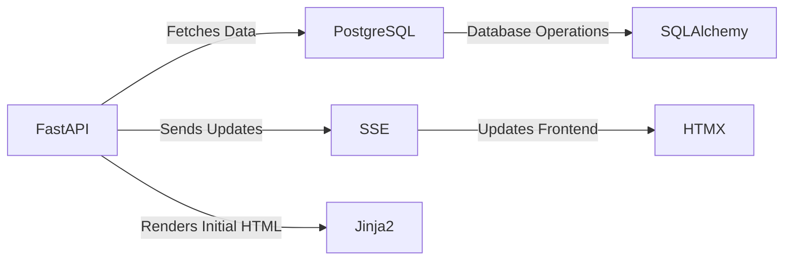

#  Real Time Updates for Displays 
Welcome and brief introduction to the topic of real-time updates for web applications, crucial for enhancing user interactivity and responsiveness.

<details>
<summary>Menu</summary>

- [Overview](#overview)
- [Architecture](#architecture)
- [Python](#python)
- [FastAPI](#FastAPI)
- [HTMX](#htmx)
- [Server-Sent Events (SSE)](#server-sent-events)
- [Jinja2 for HTML Rendering](#jinja2)
- [PostgreSQL Database System](#postgresql)
- [SQLAlchemy for Database Operations](#sqlalchemy)

</details>

## Overview

Real-time data plays a crucial role in modern web development due to its ability to provide immediate information, enhancing the user experience and enabling dynamic, interactive web applications. Here are some key points:

1. **User Experience** 🧑‍💻: Real-time data can significantly improve the user experience. For example, in social media platforms, users can see comments, likes, and shares in real time. This makes the platform more engaging and interactive.

2. **Real-Time Analytics** 📊: Real-time analytics allow businesses to make immediate decisions based on current data. This is particularly useful in areas like e-commerce, where understanding customer behavior in real time can lead to more effective marketing strategies.

3. **Collaborative Tools** 🤝: Real-time data is essential for collaborative tools like Google Docs, where multiple users can edit a document simultaneously. This wouldn't be possible without real-time updates.

4. **Notifications** 🔔: Real-time data allows for immediate notifications. For instance, when a user receives a message on a messaging app, they are notified instantly.

5. **Live Updates** 📡: In news or financial applications, real-time data provides live updates on current events or stock prices, keeping users informed at all times.

6. **IoT Devices** 🌐: Internet of Things (IoT) devices rely heavily on real-time data to function effectively. For example, a smart thermostat needs to know the real-time temperature to adjust the heating or cooling in a house.


## Architecture

- **FastAPI backend**: FastAPI is a modern, fast (high-performance), web framework for building APIs with Python 3.6+ based on standard Python type hints. It is designed to make getting started quick and easy, with the ability to scale up to complex applications. In this setup, FastAPI is used to handle all backend operations, including serving web pages, handling requests, and interacting with the database.

- **PostgreSQL as the database system**: PostgreSQL is a powerful, open-source object-relational database system. It's known for its robustness, functionality, and standards-compliance. In this setup, PostgreSQL is used to store and retrieve data for the application.

- **SQLAlchemy for database operations**: SQLAlchemy is a SQL toolkit and Object-Relational Mapping (ORM) system for Python. It provides a full suite of well-known enterprise-level persistence patterns, designed for efficient and high-performing database access. In this setup, SQLAlchemy is used to interact with the PostgreSQL database in a Pythonic way.

- **SSE for sending updates to the frontend**: Server-Sent Events (SSE) is a standard that allows a web server to push updates to the client over HTTP. In this setup, SSE is used to send real-time updates from the server (Flask app) to the client (web browser).

- **HTMX for handling updates on the frontend with minimal JavaScript**: HTMX is a modern HTML-first, JavaScript-second library for building AJAX-driven web applications. It allows you to access AJAX, CSS Transitions, WebSockets and Server Sent Events directly in HTML, using attributes, so you can build modern user interfaces with the simplicity and power of hypertext. In this setup, HTMX is used to handle the updates sent from the server and update the HTML content dynamically.

- **Jinja2 templates to render initial HTML with data from Python**: Jinja2 is a modern and designer-friendly templating language for Python. It's used for creating HTML templates that can be rendered with data from Python. In this setup, Jinja2 is used to render the initial HTML of the web pages, filling in data from the Flask app.




## Python 🐍

Python is a high-level, interpreted programming language created by Guido van Rossum and first released in 1991. Python's design philosophy emphasizes code readability with its notable use of significant indentation. It supports multiple programming paradigms, including structured (particularly, procedural), object-oriented, and functional programming.

**Use Cases**: Python is used in a wide variety of applications, including:

1. **Web Development**: Python's readability and simplicity, along with powerful frameworks like Django and Flask, make it a popular choice for web development.

2. **Data Analysis and Visualization**: Libraries such as Pandas, NumPy, and Matplotlib make Python a powerful tool for data analysis and visualization.

3. **Machine Learning and AI**: Python is one of the leading languages in machine learning, with libraries like TensorFlow, PyTorch, and Scikit-learn.

4. **Scripting and Automation**: Python's simplicity makes it a great language for scripting and automating tasks.

**Pros**:

1. **Readability**: Python's syntax is designed to be readable and straightforward, which makes it a great language for beginners.

2. **Versatility**: Python is used in many areas of development, from web applications to data analysis.

3. **Strong Community**: Python has a large and active community of users and developers who contribute to a vast library of open-source libraries and frameworks.

**Cons**:

1. **Speed**: Python is an interpreted language and can be slower than compiled languages like C or Java.

2. **Mobile Development**: While it's possible to develop mobile applications in Python, it's not as straightforward as using a language specifically designed for mobile development, like Swift or Java.

3. **Memory Consumption**: Python's flexibility can lead to higher memory consumption compared to other languages.

## FastAPI

**Overview**: FastAPI is a modern, fast (high-performance), web framework for building APIs with Python 3.6+ based on standard Python type hints. It is designed to make getting started quick and easy, with the ability to scale up to complex applications. It has become one of the most popular Python web application frameworks.

**Use Cases**: FastAPI is used in a variety of applications, including:

1. **Web Development**: FastAPI's simplicity and automatic interactive API documentation make it a great choice for building web applications and services.

2. **API Development**: FastAPI can be used to build RESTful APIs with automatic interactive API documentation.

3. **Microservices**: FastAPI's lightweight and modular design makes it a good fit for microservice architectures.

**Pros**:

1. **Simplicity**: FastAPI is simple to use and get started with. It doesn't require any particular project or code layout, so it's easy to start small and scale up.

2. **Flexibility**: FastAPI can be used to build a variety of web applications, from simple single-page apps to complex, database-driven sites.

3. **Extensible**: FastAPI can be extended with "plugins" that add functionality to your applications. There are plugins for form validation, upload handling, various open authentication technologies, and several common framework related tools.

**Cons**:

1. **Lack of Conventions**: FastAPI leaves a lot of decisions and implementation details to the developer, which can lead to problems when building larger applications or working with a team.

2. **Scalability**: While FastAPI is great for small applications, it can be less suitable for large, complex applications.

3. **Asynchronous Support**: FastAPI's request handling is asynchronous. Other frameworks like Node.js might be a better choice for applications that require handling many simultaneous connections.

## HTMX
HTMX is a modern tool that allows you to access AJAX, WebSockets, Server Sent Events, and other dynamic behaviors directly in HTML, without needing to write any JavaScript. It's a powerful tool for developers who want to create interactive web pages with less complexity.

**Background and Use Cases**:
HTMX finds its use in scenarios where developers want to keep the simplicity of server-rendered HTML, but also need the interactivity typically associated with Single Page Applications (SPAs). It's great for adding features like real-time updates, lazy loading, and infinite scrolling to your web pages.

**Pros**:
1. **Simplicity**: HTMX keeps things simple. You don't need to write JavaScript, just HTML.
2. **Lightweight**: It's a small library, so it doesn't add much to your page load times.
3. **Compatibility**: It works with any back-end that can serve HTML, making it highly versatile.

**Cons**:
1. **Limited Community**: As a relatively new tool, the community around HTMX is still growing. This can make finding solutions to specific problems more challenging.
2. **Learning Curve**: While HTMX simplifies many aspects of dynamic web development, there is still a learning curve involved, especially for developers used to JavaScript-heavy SPAs.
3. **Not a Complete Replacement**: For complex applications with heavy client-side logic, traditional JavaScript or a framework might still be necessary. HTMX is best for enhancing server-rendered pages with interactive features.

**Simplifying Web Interactivity: How HTMX Eases JavaScript Complexities**

JavaScript, while powerful, can sometimes introduce complexity and challenges in web development. HTMX aims to alleviate some of these pains.

1. **Simplicity**: JavaScript, especially when used with modern frameworks, can become complex and difficult to manage. HTMX, on the other hand, allows you to add dynamic behavior directly in HTML, reducing the need for complex JavaScript code.

2. **Reduced Load Times**: JavaScript files, particularly for large applications, can be large and impact page load times. As a lightweight library, HTMX minimizes this issue.

3. **Ease of Learning**: JavaScript has a steep learning curve, especially for beginners. HTMX simplifies this by allowing developers to work with familiar HTML syntax.

4. **Compatibility**: JavaScript can sometimes have compatibility issues across different browsers. HTMX works with any back-end that can serve HTML, making it highly versatile and less prone to compatibility issues.

5. **Server-side Rendering**: With JavaScript-heavy applications, much of the rendering logic is moved to the client-side, which can be resource-intensive. HTMX allows for server-side rendering, which can be more efficient and easier to manage.

However, it's important to note that while HTMX can alleviate some of the pains associated with JavaScript, it's not a complete replacement. For complex applications with heavy client-side logic, JavaScript or a JavaScript framework might still be necessary. HTMX is best used to enhance server-rendered pages with interactive features.


## Server Sent Events

 Server Sent Events (SSE) is a standard that allows a web server to push real-time updates to the client. This technology is part of the HTML5 specification and is designed to enhance the traditional request-response model by enabling the server to send new data to the client whenever it's available.

**Background**: Before SSE, developers often used long-polling or WebSockets to achieve real-time communication. However, these methods can be complex and resource-intensive. SSE was introduced as a simpler, more efficient alternative for one-way real-time communication from server to client.

**Implementation**: To implement SSE, the server sends a response with the `text/event-stream` MIME type. The client listens for these events using the `EventSource` API in JavaScript. The server can then send events to the client whenever there's new data available.

**Pros**:
1. **Simplicity**: SSE is easier to implement than WebSockets as it doesn't require a full-duplex connection.
2. **Efficiency**: SSE is more efficient than long-polling as it doesn't require the client to constantly check for new data.
3. **Built-in Reconnection**: If the connection is lost, SSE automatically tries to reconnect.

**Cons**:
1. **One-Way Communication**: SSE only supports one-way communication from server to client. If two-way communication is needed, other technologies like WebSockets might be more suitable.
2. **Limited Browser Support**: Not all browsers support SSE. For example, Internet Explorer doesn't support SSE.
3. **Overhead**: Each SSE connection requires a separate HTTP connection, which can add overhead if there are many connections.

More information [MDN Web Docs](https://developer.mozilla.org/en-US/docs/Web/API/Server-sent_events/Using_server-sent_events)


## Python Generators

Python Generators are a special type of function in Python that allow you to create an iterator in a fast, easy, and clean way. They were introduced as part of the Python Enhancement Proposal (PEP) 255.

**Background**: In Python, an iterator is an object that can be iterated (looped) upon. An object which will return data, one element at a time. Generators provide a convenient way to implement the iterator protocol.

**Implementation**: A Python generator is implemented as a function, but instead of returning values using the `return` statement, it uses `yield`. When the generator function is called, it returns a generator object without even beginning execution of the function. When `next()` is called for the first time, the function starts executing until it reaches the `yield` statement, which returns the yielded value. The function execution is halted at this point and the control is returned to the caller.

```python
def count_up_to(n):
  count = 1
  while count <= n:
    yield count
    count += 1

# Create a generator
counter = count_up_to(5)

# Use the generator
for num in counter:
  print(num)
```

**Use Case**: Generators are particularly useful when dealing with large data sets that you don’t want to store in memory all at once. It’s also quite useful when dealing with extremely large or even infinite series.

**Pros**:
1. **Memory Efficiency**: Generators are a great way to optimize memory. Since they yield one item at a time, they don’t need to load everything into memory.
2. **Laziness**: Generators are lazy, meaning they generate values on the fly. This laziness can lead to significant performance improvements for large data sets.
3. **Clean Code**: Generators help to write clean and readable code.

**Cons**:
1. **One-time Use**: Generators can only be iterated over once. After you’ve gone through the values, you can’t iterate over them again.
2. **Complexity**: Generators can make code more complex and harder to understand for beginners.

## SQLAlchemy

SQLAlchemy is a SQL toolkit and Object-Relational Mapping (ORM) system for Python. It provides a full suite of well-known enterprise-level persistence patterns, designed for efficient and high-performing database access.

**Overview**: Introduced in 2005, SQLAlchemy is a comprehensive library for working with SQL databases in Python. It includes a high-level ORM, low-level direct SQL access, and more.

**Use Cases**: SQLAlchemy is used in a variety of applications to:

1. **Interact with Databases**: SQLAlchemy provides a consistent and unified API to interact with different database systems.

2. **Data Mapping**: SQLAlchemy's ORM allows users to map Python classes to database tables, providing a more intuitive way to interact with databases.

3. **Data Analysis**: SQLAlchemy can be used with libraries like Pandas for data analysis tasks.

**Pros**:

1. **Versatility**: SQLAlchemy supports a wide range of SQL databases, not just SQLite.

2. **Efficiency**: SQLAlchemy's ORM and expression language enable efficient database operations.

3. **Maturity**: As a well-established library, SQLAlchemy has robust support and a large community.

**Cons**:

1. **Complexity**: SQLAlchemy's wide range of features and flexibility can make it complex to learn, especially for beginners.

2. **Performance**: While SQLAlchemy's ORM makes database operations more convenient, it can sometimes lead to slower performance compared to raw SQL.

3. **Overhead**: The abstraction provided by SQLAlchemy introduces some overhead, which might not be ideal for applications that require maximum performance.


## Jinja2
Jinja2 is a powerful templating engine for Python that allows you to generate dynamic HTML, XML, or other markup formats. It provides a flexible and efficient way to render data on the server-side and generate dynamic content for web applications.

Jinja2 is inspired by Django's template engine and is widely used in web development with frameworks like Flask and Django. It separates the presentation logic from the business logic, making it easier to maintain and update the frontend of your application.

**Use Case**: Jinja2 is commonly used in scenarios where you need to render dynamic content on the server-side. It's particularly useful for generating HTML pages with dynamic data, such as displaying user information, generating reports, or rendering real-time updates.

**Pros**:
1. **Flexible and Expressive**: Jinja2 provides a rich set of features, including conditionals, loops, filters, and macros, allowing you to create complex templates with ease.
2. **Separation of Concerns**: By separating the presentation logic from the business logic, Jinja2 promotes clean code architecture and maintainability.
3. **Extensibility**: Jinja2 allows you to define custom filters, functions, and tags, giving you full control over the template rendering process.
4. **Integration with Python**: Since Jinja2 is written in Python, it seamlessly integrates with Python code, making it easy to pass data from the backend to the templates.

**Cons**:
1. **Learning Curve**: Jinja2 has its own syntax and concepts, so there is a learning curve involved in understanding and using it effectively.
2. **Limited Frontend Interactivity**: Jinja2 is primarily focused on server-side rendering, so it may not be the best choice for highly interactive frontend components that require frequent updates without page reloads. In such cases, a JavaScript framework like React or Vue.js might be more suitable.


### References

**HTMX**
  - [Official Documentation](https://htmx.org/docs/)
  - [GitHub Repository](https://github.com/bigskysoftware/htmx)

**Server-Sent Events (SSE)**
  - [MDN Web Docs](https://developer.mozilla.org/en-US/docs/Web/API/Server-sent_events)
  - [HTML5 Rocks Tutorial](https://www.html5rocks.com/en/tutorials/eventsource/basics/)

**Python**
  - [Official Documentation](https://docs.python.org/3/)
  - [Python for Beginners](https://www.python.org/about/gettingstarted/)
  - [Python Course](https://www.codecademy.com/learn/learn-python-3)

**SQLAlchemy**
  - [Official Documentation](https://www.sqlalchemy.org/library.html)
  - [SQLAlchemy Tutorial](https://auth0.com/blog/sqlalchemy-orm-tutorial-for-python-developers/)

**Jinja2**
  - [Official Documentation](https://jinja.palletsprojects.com/en/3.0.x/)
  - [Jinja2 Tutorial](https://codeburst.io/jinja-2-explained-in-5-minutes-88548486834e)